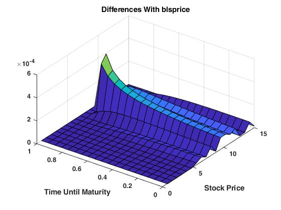
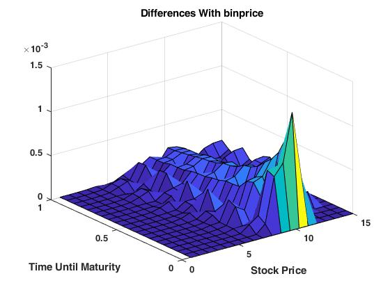
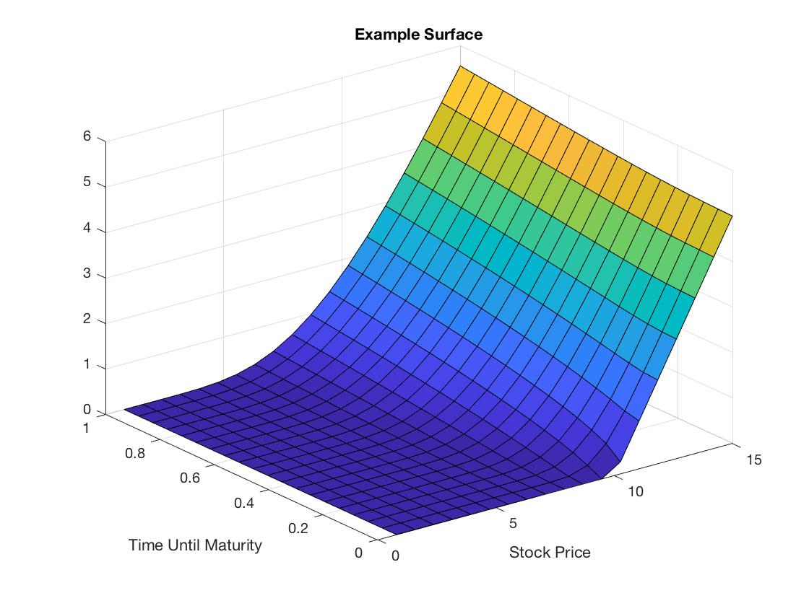

# Black-Scholes PDE Solver
This project contains MATLAB code for pricing dividend-paying American options. The techniques are based on the application of finite-difference methods to the Black-Scholes partial differential equation. However, modifications have been made to account for the free-boundary condition resulting from early exercise, as well as dividend payments in dividend-paying equities.

# Files
The following files are included in this project:
- *black_scholes_naive_explicit.m* - The application of the explicit finite-difference method on the base equation set.
- *black_scholes_naive_implicit.m* - The application of the implicit finite-difference method on the base equation set.
- *black_scholes_cov_explicit.m* - This file involves the use of a change of variables to force the PDE into the form of a heat equation. We then apply the explicit finite-difference method on the resulting equations.
- *sanity_check.m* - This file ensures the COV solution approximates results from other pricing tools. It does so by:
  - Compares prices from the included solver for calls with no dividends with the closed-form solutions from the Black-Scholes model. Theoretically, the pricing surfaces for these parameters must be equal. Thus, the numerical differences should be small.
  - Compares prices from the included solver for calls with dividends with the binomial options pricing models provided by MATLAB. As they are computing the same thing, the numerical differences should be small.
- *example.m* - Simple example script.

The sanity check should produce the following difference plot for the non-dividend case:

And the following difference plot for the dividend-paying case:

Finally, the example should produce the following plot:

# Usage
It is important to note that the naive solution is numerically unstable. As such, it should not be used for real computations; its inclusion is simply for illustrative purposes.

To use the pricing solvers, consult the example script provided. The following values are relevant:
- `N` - number of grid points in time dimension
- `M` - number of grid points in underlying price dimension
- `K` - strike price
- `T` - time until maturity
- `volatility` - the volatility of the underlying
- `r` - the risk-free interest rate
- `is_call` - set to 0 is put, 1 if call
- `d` - dividend rate

As we are using an explicit method for a PDE that has been transformed into a heat equation, established
results tell us that we need *s* = *k*/*h*^2 <= 0.5, where *k* is the step-size in time and *h* is the step-size in space.
The value of *s* is printed out when the solving function is invoked; if the value is less
than 0.5, you must change the parameter values to guarantee stability.
